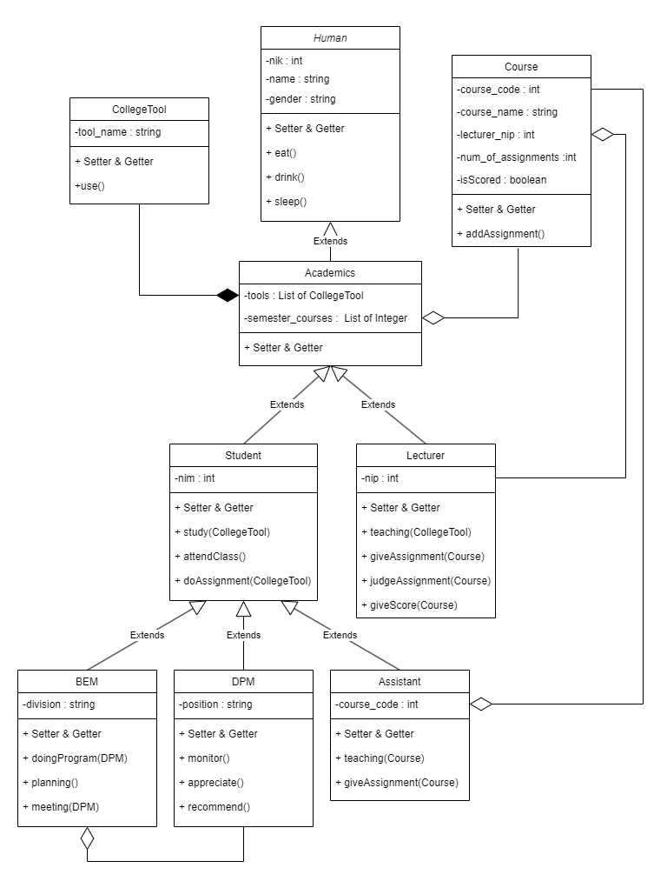
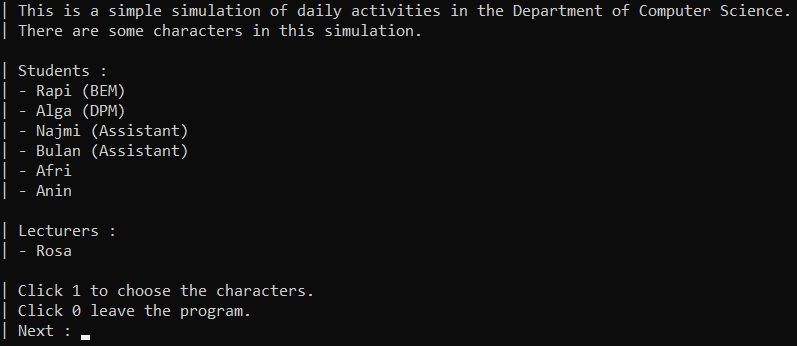
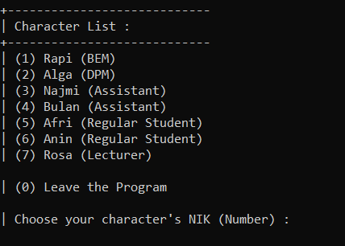
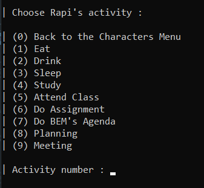
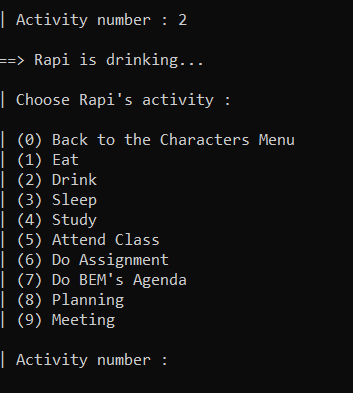
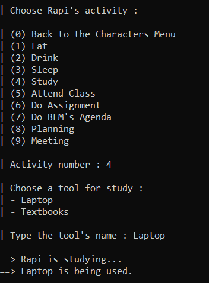
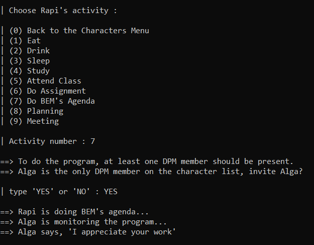
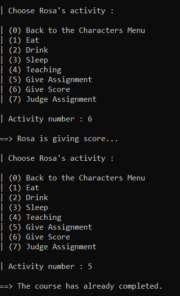

# TP1DPBO2023
Tugas Praktikum 1 Mata Kuliah Desain dan Pemrograman Berorientasi Objek. Program simulasi sederhana aktivitas objek.

Saya Najma Qalbi Dwiharani dengan NIM 2102843 mengerjakan soal TP 1 dalam mata kuliah Desain dan Pemrograman Berorientasi Objek untuk keberkahanNya maka saya tidak melakukan kecurangan seperti yang telah dispesifikasikan. Aamiin.

## Desain Program

Program ini ditulis dalam bahasa Java. Desain kelas dalam program dapat digambarkan seperti berikut:

  

Program ini terdiri dari 9 kelas, yaitu:

### 1. Human
#### Attributes
- nik
- name
- gender

#### Methods
- constructor kosong
- constructor dengan parameter seluruh atribut kelas
- setter dan getter setiap atribut

Method untuk tingkah laku manusia :
- eat()
- drink()
- sleep()

Kelas ini menjadi kelas parent dari kelas Academics karena merupakan objek yang sama dan kelas Academics membutuhkan atribut pada kelas Human.
 
### 2. Academics
#### Attributes
- tools : List of CollegeTool
    
    Atribut ini berisi list dari objek kelas CollegeTool. Atribut ini dibutuhkan karena para Academics (Lecturer & Student) memiliki beberapa tool yang akan digunakan untuk melakukan aktivitas perkuliahan.

- semester_courses : List of Integer
    
    Atribut ini berisi list kode course. Atribut ini dibutuhkan karena para Academics (Lecturer & Student) memiliki beberapa course (mata kuliah) yang dikontrak pada satu semester.

#### Methods
- constructor kosong
- constructor dengan parameter seluruh atribut kelas
- setter dan getter setiap atribut

Kelas ini menjadi child dari Human karena satu jenis objek yaitu manusia dan membutuhkan atribut dalam kelas Human. Kelas ini juga menjadi parent dari kelas Student dan Lecturer karena kedua kelas ini merupakan Human dan Academics sehingga kedua kelas ini juga membutuhkan atribut dalam kelas Academics. Kelas ini memiliki hubungan composition dengan kelas CollegeTool, dan agregasi dengan kelas Course.

### 3. Student
#### Attributes
- nim

#### Methods
- constructor kosong
- constructor dengan parameter seluruh atribut kelas
- setter dan getter setiap atribut

Method untuk aktivitas Student (mahasiswa) :

- study(CollegeTool)
    
    Aktivitas belajar. Untuk menjalankan aktivitas ini, Student perlu menggunakan salah satu tools yang ada pada atribut tools (list of CollegeTool).

- attendClass()
    
    Aktivitas menghadiri kelas.

- doAssignment(CollegeTool)
    
    Aktivitas mengerjakan tugas. Untuk menjalankan aktivitas ini, Student perlu menggunakan salah satu tools yang ada pada atribut tools (list of CollegeTool).

Kelas ini menjadi child dari kelas Academics dan cucu dari kelas Human karena Student merupakan Academics yang juga merupakan manusia (Human).

### 4. Lecturer
#### Attributes
- nip

#### Methods
- constructor kosong
- constructor dengan parameter seluruh atribut kelas
- setter dan getter setiap atribut

Method untuk aktivitas Lecturer (dosen) :

- teaching(CollegeTool)
    
    Aktivitas mengajar. Untuk menjalankan aktivitas ini, Lecturer perlu menggunakan salah satu tools yang ada pada atribut tools.

- giveAssignment(Course)
    
    Aktivitas memberikan tugas. Untuk menjalankan aktivitas ini diperlukan untuk memilih course (mata kuliah) dari semester_courses yang ingin diberikan tugas, sehingga jumlah assignment/tugas yang ada pada course itu bertambah.

- judgeAssignment(Course)
    
    Aktivitas menilai/mengvaluasi tugas. Untuk menjalankan aktivitas ini diperlukan untuk memilih course (mata kuliah) dari semester_courses yang ingin diberikan tugas, sehingga jumlah assignment/tugas yang ada pada course itu berkurang (sudah dinilai).

- giveScore(Course)
    
    Aktivitas memberikan nilai akhir pada suatu course (mata kuliah). Untuk menjalankan aktivitas ini diperlukan untuk memilih course (mata kuliah) dari semester_courses yang ingin diberikan tugas, sehingga course itu sudah diberikan nilai akhir (isScored pada course menjadi true). Lecturer hanya dapat memberikan nilai akhir setelah semua assignment yang diberikan telah dinilai (di-judge) dan hanya dapat memberikan nilai akhir sekali pada satu course. Setelah diberikan nilai akhir course dianggap selesai.

Kelas ini menjadi child dari kelas Academics dan cucu dari kelas Human karena Lecturer merupakan Academics yang juga merupakan manusia (Human). Kelas ini memiliki hubungan agregasi dengan kelas Course.

### 5. BEM
#### Attributes
- division : Divisi atau posisi pada BEM.

#### Methods
- constructor kosong
- constructor dengan parameter seluruh atribut kelas
- setter dan getter setiap atribut

Method untuk aktivitas BEM (anggota BEM) :

- doProgram(DPM)

    Aktivitas untuk melakukan program BEM. Untuk menjalankan aktivitas ini perlu mengundang anggota DPM, karena harus ada anggota DPM yang mengawasi program BEM. Jika tidak ada anggota DPM yang diundang maka program tidak dapat dijalankan.

- planning()
  
    Aktivitas untuk merencanakan program atau inovasi untuk agenda BEM.

- meeting(DPM)

    Aktivitas meeting untuk melakukan inovasi (working on inovation). Untuk menjalankan aktivitas ini perlu mengundang anggota DPM, karena harus ada anggota DPM yang mengawasi meeting BEM. Jika tidak ada anggota DPM yang diundang maka meeting tidak dapat dijalankan.

Kelas ini merupakan kelas child dari kelas Student, karena anggota BEM merupakan Student dan memiliki atribut yang dibutuhkan oleh Student serta kelas-kelas parentnya.

### 6. DPM
#### Attributes
- position : Posisi pada DPM.

#### Methods
- constructor kosong
- constructor dengan parameter seluruh atribut kelas
- setter dan getter setiap atribut

Method untuk aktivitas DPM (anggota DPM) :

- monitor()
  
    Aktivitas untuk memonitor program BEM. Untuk menjalankan aktivitas ini DPM perlu diundang oleh anggota DPM. Jika tidak ada anggota DPM yang diundang maka aktivitas ini tidak dapat dijalankan.

- appreciate()
  
    Aktivitas untuk mengapresiasi program yang dijalankan oleh anggota BEM. Untuk menjalankan aktivitas ini DPM perlu diundang dalam program yang merupakan aktivitas anggota BEM.

- recommend()

    Aktivitas memberikan rekomentasi pada meeting yang dilakukan oleh BEM. Untuk menjalankan aktivitas ini DPM perlu diundang dalam meeting yang merupakan aktivitas anggota BEM.

Kelas ini merupakan kelas child dari kelas Student, karena anggota DPM merupakan Student dan memiliki atribut yang dibutuhkan oleh Student serta kelas-kelas parentnya. Aktivitas DPM hanya dapat dijalankan ketika BEM ada yang menjalankan aktivitas juga.

### 7. Assistant
#### Attributes
- course_code : Kode course (mata kuliah) yang diampu oleh asisten.

#### Methods
- constructor kosong
- constructor dengan parameter seluruh atribut kelas
- setter dan getter setiap atribut

Method untuk aktivitas Assistant :
- teaching(Course)

    Aktivitas untuk mengajar. Untuk menjalankan aktivitas ini perlu Course yang kodenya sesuai dengan course_code.

- giveAssignment(Course)
    
    Aktivitas untuk memberikan tugas/homework. Untuk menjalankan aktivitas ini perlu Course yang kodenya sesuai dengan course_code dan course tersebut harus belum selesai (belum diberikan nilai oleh dosen).

Kelas ini merupakan kelas child dari kelas Student, karena Assistant merupakan Student dan memiliki atribut yang dibutuhkan oleh Student serta kelas-kelas parentnya. Assistant hanya dapat memberikan tugas/homework tapi tidak dapat menilai tugas tersebut, tugas hanya dapat dinilai oleh Lecturer (dosen).

### 8. Course
#### Attributes
- course_code : Kode course (mata kuliah).
- couse_name : Nama course (mata kuliah).
- lecturer_nip : NIP dari Lecturer pengampu course ini. Diasumsikan hanya dapat ada satu dosen yang mengampu satu course.
- num_of_assignments : Jumlah tugas yang belum dinilai sekarang.
- isScored : Penanda apakah course ini sudah diberikan nilai akhir atau belum. Jika sudah, maka course dianggap selesai dan tidak akan bisa diberikan assignment lagi.

#### Methods
- constructor kosong
- constructor dengan parameter seluruh atribut kelas
- setter dan getter setiap atribut

Method tambahan :

- addAssignment()
    
    Menambah 1 pada num_of_assignment, yang berarti ada penambahan satu tugas pada course ini.

Kelas ini merupakan kelas independen yang memiliki hubungan agregasi dengan kelas Academics, Assistant, dan Lecturer.

### 9. CollegeTool
#### Attributes
- tool_name : Nama tool/peralatan yang dapat membantu perkuliahan.

#### Methods
- constructor kosong
- constructor dengan parameter seluruh atribut kelas
- setter dan getter setiap atribut

Method tambahan :
- use()
  
    Menggunakan tool.

Kelas ini merupakan kelas independen yang memiliki hubungan composite dengan kelas Academics. Kelas ini diperlukan karena para Academics memiliki tool/alat untuk digunakan dalam perkuliahan.

### Program/Kelas Main

Program ini berisi simulasi sederhana tentang aktivitas beberapa karakter yang betemakan kehidupan perkuliahan. Karakter dan objek yang ada pada program ini :

Student :
- Afri
- Anin

BEM :
- Rapi
  
DPM :
- Alga

Assistant :
- Najmi
- Bulan

Lecturer :
- Rosa

Course :
- DPBO
  
CollegeTool :
- Laptop
- Textbooks
- Board_Markers

Program ini adalah program sederhana sehingga pada objek yang hanya ada satu untuk mewakilkan suatu kelas belum bisa berjalan dengan optimal jika objeknya ditambah kemudian dijalankan di program main ini. Kemudian masih banyak error handling yang belum ada pada program ini, sehingga dianggap bahwa user hanya memberikan input yang ideal.

## Batasan Interaksi Antar Objek

### 1. DPM hanya dapat menjalankan aktivitas DPM ketika BEM juga menjalankan aktivitasnya (do program & meeting), BEM juga perlu mengundang DPM untuk menjalankan aktivitasnya

### 2. Student hanya dapat mengerjakan assignment jika ada assignmet dari semua course yang ada pada course list milik Student tersebut

Dalam contoh program ini hanya ada satu course yang dimiliki oleh student

### 3. Assignment yang diberikan oleh Lecturer dan Assistant dianggap sama, dan keduanya hanya dapat dinilai oleh Lecturer

### 4. Lecturer hanya dapat menilai assignment jika ada assignment pada course

### 5. Lecturer hanya dapat memberikan nilai akhir (score) jika tidak ada lagi assignment yang belum dinilai 

### 6. Setelah course diberikan nilai akhir maka tidak dapat memberikan assignment lagi pada course tersebut

### 7. Pada beberapa aktivitas perkuliahan dibutuhkan tool untuk melakukan aktivitas tersebut

## Alur Program

### Menampilkan Pendahuluan Program

  

Program akan menampilkan pendahuluan dan daftar karakter yang ada pada program ini. Kemudian program akan meminta perintah selanjutnya, yaitu untuk menginput 1 agar melanjutkan untuk memilih karakter, atau menginput 0 agar keluar dari program.

### Menampilkan Pilihan Karakter

  

Program akan menampilkan daftar karakter yang dapat dipilih beserta keterangannya. Kemudian user akan diminta untuk memilih karakter dengan menginput NIK (nomor) karakter yang diinginkan. Jika menginput 0 maka akan keluar dari program.

### Menampilkan Pilihan Aktivitas

  

Program akan menampilkan pilihan aktivitas yang dapat dilakukan oleh karakter yang telah dipilih sebelumnya. User diminta untuk menginput nomor aktivitas yang diinginkan untuk dilakukan oleh karakter. Jika menginput 0 maka akan kembali ke menu pilihan karakter.

### Menampilkan Respon dan Menampilkan Pilihan Aktivitas Selanjutnya

  

Program akan menampilkan respon dari aktivitas yang dipilih sebelumnya, respon dapat berbeda-beda tergantung dari aktivitas yang dipilih. Kemudian program akan menampilkan lagi pilihan aktivitas selanjutnya. Hal ini akan terus berulang sampai user kembali ke menu karakter.

## Dokumentasi

### Aktivitas dengan menggunakan tools

  

### Aktivitas BEM yang membutuhkan DPM

  

### Aktivitas ketika memberikan assignment setelah course diberikan nilai akhir

  
